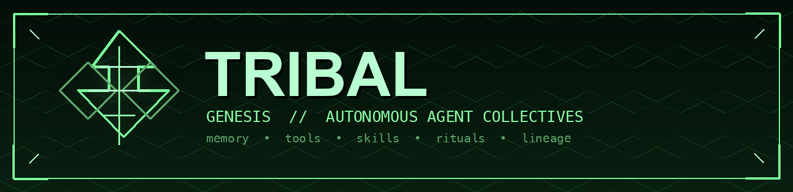

# Tribal



**Tribal is an open-source runtime for autonomous agent collectives.**

Tribal Genesis is the foundation release of the Tribal runtime. It ships a self-improving agent loop, skills, memory, tools, messaging gateway, cron scheduler, TUI, dashboard, ACP, MCP, and plugin architecture while setting the project direction around coordinated agent societies.

Genesis is the foundation release. The Lemma, Elder, Ritual, Lineage, Oracle, and simulation layers are the next phase.

## What Tribal Is

Tribal keeps the useful operational base:

- A terminal-first agent runtime with tool calling and long-running execution.
- Persistent memory, skill discovery, and self-improvement loops.
- Messaging gateways for platforms like Telegram, Discord, Slack, WhatsApp, Signal, and email.
- Cron scheduling for unattended work.
- A plugin system for tools, memory providers, model providers, dashboard surfaces, and integrations.
- TUI, dashboard, ACP, and MCP support.

Tribal changes the direction:

- From one assistant to coordinated agent collectives.
- From generic memory to domain-specific tribal knowledge.
- From single-agent autonomy to roles, lineage, rituals, and governance.
- From task automation to autonomous operational societies.

## Install From Source

```bash
git clone <your-tribal-repo-url> tribal
cd tribal
./setup-tribal.sh
./tribal
```

Manual development setup:

```bash
uv venv .venv --python 3.11
source .venv/bin/activate
uv pip install -e ".[all,dev]"
scripts/run_tests.sh tests/test_project_metadata.py
```

Windows users can install with the PowerShell installer:

```powershell
iex (irm https://raw.githubusercontent.com/Tribal/tribal/main/scripts/install.ps1)
```

## Commands

```bash
tribal              # Start the interactive CLI
tribal --tui        # Start the modern terminal UI
tribal dashboard    # Start the local web dashboard
tribal model        # Choose a model provider
tribal tools        # Configure enabled tools
tribal setup        # Run setup
tribal genesis      # Birth this agent's founding tribe and lineage
tribal gateway      # Run messaging gateway
tribal doctor       # Diagnose local configuration
```

`tribal genesis` is the difference between an agent on its first day and one born with lineage.

## Upstream Attribution

See [UPSTREAM.md](UPSTREAM.md) for attribution details. The original MIT license is preserved in [LICENSE](LICENSE).
